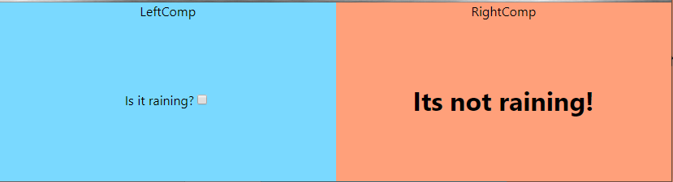
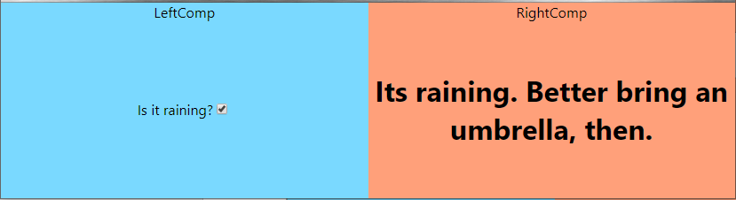
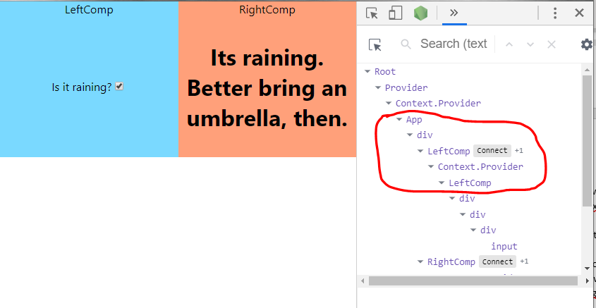
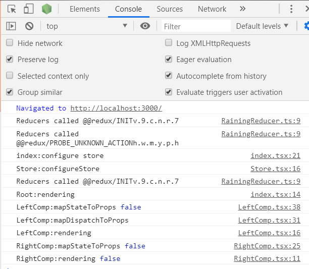
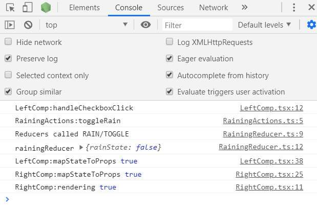

# The smallest react-redux typescript real world example imaginable

We want to make an as simple as possible react app that uses redux with typescript.

The examples I have seen so far, always explains this “inside-out”, starting with all the details and loosing the overview in the process. I’m going to try the opposite, explaining from the “outside-in”, which means that you need to be patient about the details, but try to catch the fundamental overview of how this works.

I am not going to explain to you why typescript is better than javascript as this should be obvious.

Neither am I going to explain why people use redux. Others explain this quite well elsewhere (https://blog.logrocket.com/why-use-redux-reasons-with-clear-examples-d21bffd5835/). If you are here, I assume that you need to. 

I have added some console.log statements liberally around in the code. These you can use to study which functions are called when, and in which sequence.

The simplest thing must be a Boolean value, and we use a checkbox in one component (the LeftComp) to set it, and we show it by changing some text in another component (the RightComp):


And then, when you click:



1.	Goto github and grab a copy of the code: https://github.com/vonNord/EasyEx
1.  Run ```npm install``` in the root directory

    If you want to create such an app (I optimistically named mine easyex):

        ```
        npx create-react-app easyex –typescript
        cd easyex
        npm install redux
        npm install react-redux
        npm install --save.dev @types/react-redux
        npm install redux-thunk
        npm install --save.dev @types/redux-thunk
        ```

1.	Open the easyex folder with VS Code

1.	Open index.tsx. We need to make a top level component “Root” because we want to wrapp all components with the react-redux Provider component. The Provider holds the store and cooperates with the connect function to give the components in the Left and Right components the props they need.

    ```tsx
    import React from "react";
    import ReactDOM from "react-dom";
    import { Provider } from "react-redux";
    import "./index.css";
    import App from "./App";
    import { Store, AnyAction } from "redux";
    import configureStore, { IApplicationState } from "./Store";

    interface IProps {
        store: Store<IApplicationState>;
    }
    const Root: React.SFC< IProps > = props => {
        console.log("Root:rendering");
        return (
            <Provider store={props.store}>
                <App />
            </Provider>);
    };

    console.log( "index:configure store");
    const store: Store< IApplicationState, AnyAction> = configureStore();
    ReactDOM.render(<Root store={store} />
        , document.getElementById("root"));
    ```
1.	It is wise to separate things in your application by entity, or area, instead of by filetype. I would advise against making a folder for all the types, and another for all the actions etc.

    It is far better to make a folder for each area your application handles. In this case it is the raining area that is separated from the rest, and I have therefor a “raining” folder that contains the types, actions, reducer for the raining things. Even the components since they only work with raining stuff.
1.  Here is the clean and simple App.tsx:
    ```tsx
    import React from "react";
    import "./App.css";
    import LeftComp from "./raining/LeftComp";
    import RightComp from "./raining/RightComp";

    const App: React.FC = () => {
    return (
        <div className="App">
        <LeftComp /> <RightComp />
        </div>
    );
    ```
    As you see, we are using two components, LeftComp and RightComp, that we haven’t created yet. We place them side by side (we’ll add some css later to make them stay side by side).

1.	Let us make the Left component:
    ```tsx
    import * as React from "react";
    import { toggleRain } from "./RainingActions";
    import { connect } from "react-redux";
    import { IApplicationState } from "../Store";

    interface IProps {
        onCheckboxClick: typeof toggleRain;
    }

    const LeftComp: React.SFC<IProps> = (props: IProps) => {
        const handleCheckboxClick = () => {
            console.log("LeftComp:handleCheckboxClick");
            props.onCheckboxClick();
        };

        console.log("LeftComp:rendering" );
        return (
            <div className="comp-container LeftComp">
                LeftComp
                <div className="comp-container-A">
                    <div className="comp-container-B">
                        Is it raining?
                        <input type="checkbox" onChange={handleCheckboxClick} />
                    </div>
                </div>
            </div>
        );
    };

    const mapDispatchToProps = (dispatch: any) => {
        console.log("LeftComp:mapDispatchToProps");
        return {
            onCheckboxClick: () => dispatch(toggleRain())
        };
    };

    const mapStateToProps = (store: IApplicationState) => {
        console.log("LeftComp:mapStateToProps", store.rain.rainState );
        return {
        };
    };

    export default connect(mapStateToProps, mapDispatchToProps)(LeftComp);
    ```

    As you see, lots and lots of details here, but let us focus on the important stuff:
    1.	Let's start with the render function, which mostly tries to center the content, but also manages to hook up the onChange function on the checkbox to handleCheckboxClick. This function is obviously central in changing the state.
    1.  Let's look at the handleCheckboxClick function then. It just calls the props onCheckboxClick function. 
    1.  Which leads our investigation to the props interface. We have a Props interface that only contains a function. But wht wil happen when that props function is called?
    1.  The answer is in the mapDispatchToProps function. It instructs react-redux what to do when the onCheckboxClick function is called. As you see, it will provide you with a dispatcher, which you use to call the toggleRain function. (toggleRain will create an Action which will call the reducer which will update the store. But we are getting a little ahead of ourselves here.)
    This function we give to react-redux in the last line through the connect function.


    1.	The mapStateToProps function does not do anything, because we do not have anything in the state that shall be inserted into the props. (We could insert the value for the checkbox here, but I’m trying to make this example very simple. More about this in the next example.)
    1.	Finally, we call the magic connect function from react-redux that hooks everything up. 
    
        But one thing first: What is up with those second parentheses? Well, connect is a function that returns a function, the second set of parentheses are for that function. We could so this instead:

        ```typescript
        const connected 
        = connect( mapStateToProps, mapDispatchToProps );

        export default connected(LeftComp);
        ```

        Which makes far more sense to me.
        (see https://blog.jakoblind.no/redux-connect-subscribe/ for more on this subject.)

    1.  Notice that we export the return value from the connect as default here. *This is important.*      
        When App.tsx imports something it calls LeftComp, it is not the LeftComp component, but rather the connect return value. The real return value is a component that wraps the LeftComp.
    
        When we look at the app from the Components view in React Developer Tools in chrome (or firefox), we see that there are two layers between the App’s div and the real LeftComp. One called “LeftComp” (which is like a fake facade) and the second one is a Context.Provider.
        
        The Context.Provider will use the two functions, mapDispatchToProps and mapStateToProps, to create the LeftComp’s props for you. And when the props change, React will call render which will draw the component (again).

    

    >IApplicationState? There are some types that we must declare befor we go on:

1. Here is the types file:
    ```typescript
    export enum RainingActionTypes {
        TOGGLERAIN = "RAIN/TOGGLE"
    }

    export interface IRainingState {
        readonly rainState: boolean;
    }

    export interface IRainingCheckboxClickAction {
        type: RainingActionTypes.TOGGLERAIN;
    }

    export type RainingActions = IRainingCheckboxClickAction;
    ```

    1.  The enum on the top gives us a simple and typesafe way of identifying the actions. As you see, the enum is actually a string, and it is very important that they are unique. This is achieved by using a hierarchical structure with the “RAIN” part being common for all the actions in this part of the application.
    1.  The IRainingState interface was covered before in section 10.
    1.	The IRainingCheckboxClickAction is interesting. It contains nothing except the type, which such action interfaces must have. And as you see it is set to RainingActionTypes.TOGGLERAIN, which means that it must have this value only, and no other will be tolerated by the typescript compiler. This is very nice, because it will help you avoid an error.
    1.	Finally, we have the RainingActions, which, if we had more than one action, would be or’d together so that we have a combined type that only will accept actions from the set that has to do with the raining. This is how it would look of we had two actions:

    ```typescript
    export enum RainingActionTypes {
        TOGGLERAIN = "RAIN/TOGGLE",
        ENTERRAINAMOUNT = "RAIN/ENTERAMOUNT"
    }

    export interface IRainingState {
        readonly rainState: boolean;
    }

    export interface IRainingCheckboxClickAction {
        type: RainingActionTypes.TOGGLERAIN;
    }

    export interface IRainingEnterAmountAction {
        type: RainingActionTypes.ENTERRAINAMOUNT;
        rainAmount: number;
    }

    export type RainingActions
    = | IRainingCheckboxClickAction | IRainingEnterAmountAction;
    ```


>But let's look at that toggleRain function we just used in LeftComp:

1.	We find it in the action file:
    ```typescript
    import { RainingActionTypes, IRainingCheckboxClickAction }
    from "./RainingTypes";
    import { ActionCreator } from "redux";

    export const toggleRain: ActionCreator<IRainingCheckboxClickAction>
    = () => {
        console.log("RainingActions:toggleRain");
        return {
            type: RainingActionTypes.TOGGLERAIN
        };
    };
    ```
    This file should perhaps be called the action creator file, since the only thing in here is the toggleRain Action-creator function.

    The toggleRain function returns an object that only has one property; a property named "type" that has an enum value as its type. And can therfor not be anything else than exactly that enum value(!)

    These action creator functions have many vriants, and in the other examples in this series I will look into variations of them. You will often find that you have some data in such an event. This data is often refered to as the "payload" and are inserted into the return object.

    If you have any need to call a rest service, you would do it here. You can see this function being called in LeftComp’s mapDispatchToProps.


    > But back to the big picture here; what happens to this returned action object? It is sent to the reducer as the "action" parameter:

1.	The reducer file:
    ```typescript
    import { Reducer } from "redux";
    import { RainingActions, RainingActionTypes, IRainingState } 
    from "./RainingTypes";

    const initialRainingState: IRainingState = {
        rainState: false
    };

    export const rainingReducer: Reducer< IRainingState, RainingActions>
    = (state = initialRainingState, action) => {
        console.log("Reducers called", action.type );
        switch( action.type ) {
            case RainingActionTypes.TOGGLERAIN: {
                console.log("rainingReducer", state);
                return {
                    ...state,
                    rainState: !state.rainState
                };
            }
        }
        return state || initialRainingState;
    };
    ```

    1. The reducer is inserted into the system in the store file.	
    1. We start by defining an initial state; we start with the checkbox not checked. This is the default. But since we are not setting the checkbox value/checked state, if we set this initial state to true the checkbox will not be checked. More about that in the next example.
    1.	Then we have the reducer function, which is actually really easy. It is called with a state and an action, and the first time it will be called with that initial state set.
    1.  Notice that the reducer function is inserted into the system in the store file.	
    1.	And notice that we only get the IRainingState in here.
    1.	The action has the type parameter, which we use to switch on.
    1.	If the reducer was called with our action.type, we make a new state and return that. We do that by:
        1.	first creating an empty object
        1.	then we spread the values of the old state into that object
        1.	finally we overwrite the values with the ones we would like to change.
    1.	It is a bit unusual to just toggle the state.rain as we do here. Normally we would take data from the action and use that. More about this in the next example.
    1.	The final: if we get past the switch, and have a state, we return that, else we return the initial state.

>But,...where is it going? Who is holding the data? The store???

1.  The store! 
    ```typescript
    import { applyMiddleware, combineReducers, createStore, Store, AnyAction 
    } from "redux";
    import thunk from "redux-thunk";

    import { rainingReducer } from "./raining/RainingReducer";
    import { IRainingState } from "./raining/RainingTypes";

    export interface IApplicationState {
        rain: IRainingState;
    }

    const rootReducer = combineReducers<IApplicationState>({
        rain: rainingReducer
    });

    export default function configureStore(): Store<IApplicationState> {
        console.log("Store:configureStore");
        const store: Store< IApplicationState, AnyAction> 
    = createStore( rootReducer, undefined, applyMiddleware( thunk ) );
        return store;
    }
    ```
    The redux store is a place where we store all the state we need to have in the system, at least all the state that shall be shared between components. (But we might as well keep everything in there to keep things simple.) In our example we have only a Boolean, but normally we would have a lot in a hierarchical structure. IRainingState is an interface that is defined in a file named RainingTypes.ts:

    ```typescript
    export interface IRainingState {
        readonly rainState: boolean;
    }
    ```
    So, the store has an IRainingState (which takes care of the Raining stuff in our application), which holds the rainState Boolean.
    Which you can see is used by RightComp’s mapStateToProps to set the local props.

    1.	We combine Reducers, but we only have one in our example. Normally you would have several reducers and you register them here (so that they will be called later).
    2.	We could create a simpler store, without the thunk middleware nonsense for this example. But to be able to call web or rest services we need to be able to handle asynchronous calls, and that is what the thunk middleware gives us. I do not call anything asynchronously in this example, but I’ve kept it since you are going to use it anyway. (See the 4th example in this series.)


> So, the user checks the checkbox in LeftComp. This is reported by creating an action. The action is run through a reducer, who updates the store for us. Now lets see how another component can benefit from this.


8.	Let us take a look at RightComp:
    ```tsx
    import * as React from "react";

    import { connect } from "react-redux";
    import { IApplicationState } from "../Store";

    interface IProps {
        isItRaining: boolean;
    }

    const RightComp: React.SFC<IProps> = (props: IProps) => {
        console.log("RightComp:rendering", props.isItRaining );
        return (
            <div className="comp-container RightComp">
                RightComp
                <div className="comp-container-A">
                    <div className="comp-container-B">
                <h1>{props.isItRaining 
                    ? "Its raining. Better bring an umbrella, then." 
                    : "Its not raining!"}
                </h1>
                    </div>
                </div>
            </div>
        );
    };

    const mapStateToProps = (store: IApplicationState) => {
        console.log("RightComp:mapStateToProps", store.rain.rainState);
        return {
            isItRaining: store.rain.rainState
        };
    };

    const connected = connect( mapStateToProps );
    export default connected(RightComp);
    ```
    1.	This component has a props with only a Boolean, isItRaining, which reflects the state of the checkbox.
    1.	It uses this props to figure out which one of the two texts to show in the return (render) part.
    1.	Since the component doesn’t change any state, it doesn’t have any mapDispatchToProps function.
    1.	It has a mapStateToProps function, which takes the store.rain.rainState and uses it to set the local props isItRaining.
    1.	Finally, we call the connect function, like before.


1.	The css file:
    ```css
    .comp-container-A {
    display: table;
    overflow: hidden;
    width: 100%;
    }

    .comp-container-B {
    display: table-cell;
    vertical-align: middle;
    height: 200px;
    }

    .LeftComp {
    background-color: #7AD9FF;
    }
    .RightComp {
    background-color: lightsalmon;
    }
    ```
    Just insert this at the end of the file

1.	Aaaaand that should be it.
    If you do these things, make these functions, react-redux will call them for you in a manner that makes all this work. 

1.  What helped me was to see the sequence the functions was called in.
    Here is when the application starts up:
    

1.
    1.	As you see, the reducer is called twice first, but with an to us, unknown type. So we can ignore those calls.
    1.	Then index is called, which calls the Store.configureStore.
    1.	Another of those reducer calls, also safely ignored.
    1.	Now Root is rendering. Root, as you remember, is the thing we made to wrap the Provider component.
    1.	LeftComp:mapStateToProps is called, obviously the system has gone down the component hierarchy and the wrapper for LeftComp are working on preparing the props for the component.
    1.	As expected, then LeftComp.mapDispatchToProps is called. Need to set up that function.
    1.	Then, LeftComp.render is called
    1.	Then RightComp is given props and rendered

1. Here is when I click the checkbox:

    
    1.	First, the LeftComp.handleCheckboxClick is called. That makes sense, we hooked it up to be called in the rendering. It calls the toggleRain function.
    1.	So, the RainingActions.toggleRain action creator function is called. Here we create an action which only contains the type RAIN/TOGGLE. (Normally, there would also be some data here, the payload. Typically, the payload would be fetched from a web service.) 
    1.	Then the reducers are called, this time with the type created in the previous step. 
    1.	Since we recognize the type, we create a new state based on the old, but where the rainState is toggled.
    1.	Then a lot of magic happen. You might expect the Root component to render now? Nope, it does not, because it doesn’t have changed props. However, the system seems to be checking all the components. Eventually, it comes to the LeftComp’s wrapper. This wrapper calls LeftComp.mapStateToProps since the state has changed. But it obviously compares the value this function returns with the old one, because it does not call render!
    1.  Notice that LeftComp.mapDispatchToProps is not called. I suspect that those functions are only set up once.
    1.	Then the same happens to RightComp, except that the mapStateToProps function returns a props that are different!
    1.	So, therefor, the system calls RightComp.render.

And then we're done!

Except that we are not really done. This example is very, very simple, almost too simple. I try to make it a little more realistic in the rest of the examples.

I made some more examples built on this one:
*   https://github.com/vonNord/EasyEx   (this example)
*   https://github.com/vonNord/EasyEx_2
*   https://github.com/vonNord/EasyEx_3
*   https://github.com/vonNord/EasyEx_4
